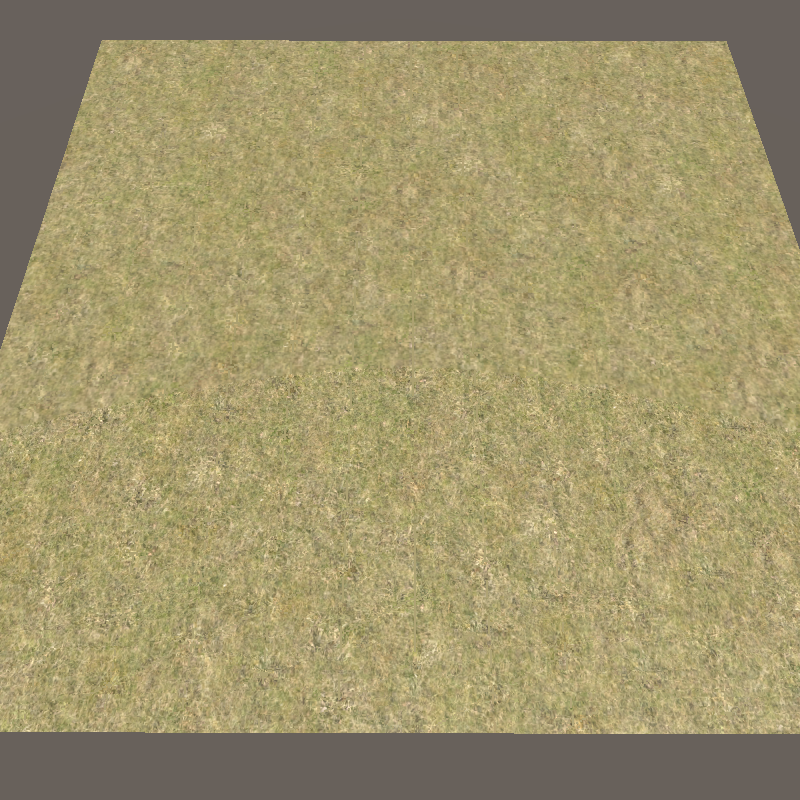

# ShaderGraphStochastic

Stochastic Texture Shader Graph Node

## How Use

https://youtu.be/xC38HBk0zC8

## References:

Shader adaptation from this:
https://www.reddit.com/r/Unity3D/comments/dhr5g2/i_made_a_stochastic_texture_sampling_shader/

